<div align="center">

# 👋 Hey, I'm Aman Verma

### AI Engineer Building Intelligent Systems, Not Just Experiments


</div>

---

## 🚀 What I Build

```python
class AIEngineer:

    def __init__(self):
        self.name = "Aman Verma"
        self.role = "AI Engineer"
        self.focus = [
            "Generative AI",
            "Agentic AI",
            "RAG",
            "Machine Learning",
            "Deep Learning"
        ]
        self.mindset = "Learn by building, build to solve"

    def current_status(self):
        return {
            "🎯 Building": "AI-driven applications that solve real problems",
            "📚 Learning": "Agentic AI, LLMs and advanced AI systems",
            "💻 Problem Solving": "430+ LeetCode problems in C++",
            "🌍 Based": "India"
        }

    def experience(self):
        return {
            "ML": "Machine Learning Centre of Excellence",
            "AI": "AWS Cloud Club AKGEC",
            "development": "FastAPI + Docker + MongoDB"
        }
```

I'm passionate about building intelligent systems using **Machine Learning, Deep Learning and Generative AI**.

My journey started with **Machine Learning and Deep Learning**, and gradually moved towards **NLP, Transformers, LLMs, RAG and Agentic AI**. Today, I focus on turning these concepts into practical AI-driven applications.

> **I learn by building, and I build to solve**

<div align="center">
<br>

### 🚀 Systems I've Built

</div>

<table>
<tr>

<td width="33%">

### 🤖 RecruitAI Agent

**Agentic AI Recruitment Platform**

* 🧠 LangGraph-based agentic workflows
* 📝 Automated question generation
* 🎯 LLM-powered evaluation
* ⚡ FastAPI backend

**Tech:** LangGraph • LLMs • FastAPI

</td>

<td width="33%">

### 🏠 AwadhLease AI

**AI-Powered Lease Management**

* 📄 Intelligent document processing
* 🤖 AI-assisted property workflows
* 🔐 JWT authentication
* 🗄️ FastAPI + MongoDB

**Tech:** GenAI • FastAPI • MongoDB

</td>

<td width="33%">

### 🛰️ OrbionX

**AI Space Intelligence Platform**

* 🛰️ Satellite tracking
* 📈 Orbital trajectory prediction
* ⚠️ Collision event detection
* 🌐 Interactive 3D visualization

**Tech:** PyTorch • FastAPI • SGP4 • React

</td>

</tr>
</table>

<div align="center">

### 🎥 Other AI Work

**YouTube RAG Chatbot** • **Heart Disease Predictor** • **Credit Risk Prediction** • **Fashion MNIST CNN** • **Next Word Predictor**

</div>

---

<div align="center">
<br>

## 🛠️ Tech Arsenal

### Core Stack


### AI/ML & GenAI


### Data & Tools


</div>

---
<br>

## 📊 GitHub Stats

<div align="center">


</div>

---
<br>

## 🎯 What Makes Me Different


```yaml
mindset:

  - "Learn by building"
  - "Understand the fundamentals"
  - "Build projects, not just tutorials"

approach:

  learn: "Understand the concept before using the tool"
  build: "Turn concepts into working applications"
  solve: "Focus on real-world problems"

philosophy:

  - Bridge the gap: "Learning → Building"
  - Combine AI with practical applications
  - Keep improving through problem solving

current_exploration:

  - Agentic AI systems
  - RAG and LLM applications
  - Advanced LangGraph workflows
  - Production-ready AI applications
```

---
<br>

## 📈 The Journey

```mermaid
graph LR

    A[Python & Data] --> B[Machine Learning]
    B --> C[Deep Learning]
    C --> D[NLP & Transformers]
    D --> E[Generative AI]
    E --> F[RAG & LLMs]
    F --> G[Agentic AI]
    G --> H[Building Real-World AI]

    style A fill:#00D9FF,stroke:#fff,stroke-width:2px,color:#000
    style B fill:#00D9FF,stroke:#fff,stroke-width:2px,color:#000
    style C fill:#00D9FF,stroke:#fff,stroke-width:2px,color:#000
    style D fill:#00D9FF,stroke:#fff,stroke-width:2px,color:#000
    style E fill:#00D9FF,stroke:#fff,stroke-width:2px,color:#000
    style F fill:#9B59B6,stroke:#fff,stroke-width:2px,color:#fff
    style G fill:#9B59B6,stroke:#fff,stroke-width:2px,color:#fff
    style H fill:#FF6B6B,stroke:#fff,stroke-width:3px,color:#fff
```



---
<br>

## 💼 Experience

**Machine Learning Engineer — Machine Learning Centre of Excellence**
*November 2025 – Present*

**AI Engineer — AWS Cloud Club AKGEC**
*December 2025 – Present*

---
<br>

## 💻 Problem Solving

**430+ LeetCode Problems Solved**

Currently practicing **DSA in C++**, focusing on problem solving, efficient algorithms and writing optimized solutions.

---

<div align="center">
<br>

## 📫 Let's Build Something Amazing

<a href="https://linkedin.com/in/aman-verma-8126b7324">

</a>

<a href="https://amanverma-98.github.io/Portfolio-Aman/">

</a>

<a href="mailto:coderaman18@gmail.com">

</a>

<a href="https://instagram.com/amanverma._18">

</a>

</div>

---
<br>

### 💡 Currently Open To

🚀 **AI/ML Engineering opportunities** involving Generative AI, Agentic AI and intelligent applications

🤝 **Open Source collaborations** around AI/ML, LLMs and developer tools

🔬 **Research & projects** in Machine Learning, Deep Learning and Generative AI

---

<div align="center">
<br>

### 🎖️ Recognition

**430+ LeetCode Problems** • **AI/ML Projects** • **MLCoE & AWS Cloud Club**

</div>

---


<div align="center">


</div>

---
<br>

<details>

<summary>📚 More About My Tech Philosophy</summary>

<br>

### Why I Build What I Build

I believe the best way to learn technology is to **build with it**.

1. **Understand the fundamentals** — Don't just use a library; understand what it does.
2. **Build real projects** — Turn concepts into working applications.
3. **Solve problems** — Use technology to solve practical problems.
4. **Keep improving** — Every project should teach something new.

<br>
### My Learning Approach

```python
def learn(technology):

    steps = [
        "Understand the fundamentals",
        "Build a small prototype",
        "Experiment and break things",
        "Build a real project",
        "Improve and optimize"
    ]

    return "Learn → Build → Solve → Repeat"
```

</details>

---

<div align="center">
<br>

### Fun Fact

```javascript
const lifeBalance = {

    code: "40%",
    learn: "25%",
    build_projects: "20%",
    solve_problems: "15%",
    coffee: "∞%"
};
```

**Build. Learn. Solve. Repeat**

</div>
